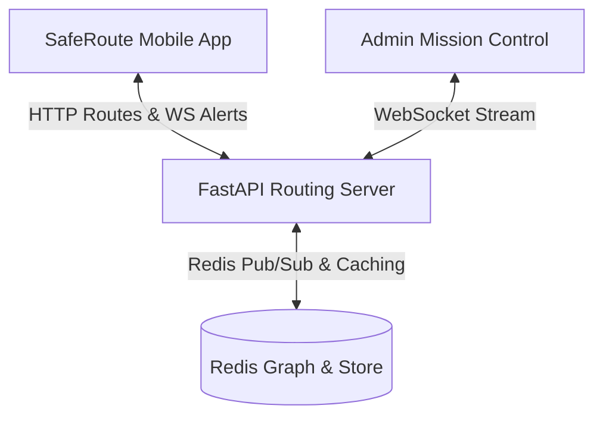

# SafeRoute System Integration Testing & Quality Assurance Plan

This document serves as our operational blueprint and tracking sheet for the End-to-End (E2E) testing phase. It outlines every component, test case, verification criterion, and potential failure state across the mobile app, backend routing server, and admin dashboard.

---

## System Architecture Reference

---

## 1. Phase Tracking Board

Use this list to check off statuses during our testing:

| Test ID | Module | Target System | Focus Area | Status | Remarks |
|:---|:---|:---|:---|:---:|:---|
| **T-100** | SOS | Mobile ➔ Backend ➔ Admin | Live Emergency Broadcast | ▢ *Pending* | Trigger from phone, monitor socket & admin map |
| **T-200** | Routing | Mobile ➔ Backend | Dynamic Multi-Route Generation | ▢ *Pending* | Compare Fastest vs Safest, test identical override |
| **T-300** | Map | Mobile UI | Dynamic Time Tags & Midpoints | ▢ *Pending* | Test tap-to-select tag, verify text is correct |
| **T-400** | UI | Mobile Navigation | Active Drive Mode & HUD | ▢ *Pending* | Verify top turn banner, speed fluctuating, X button |
| **T-500** | Admin | Control Panel | Pathfinding Tuning & Weight Adjust | ▢ *Pending* | Adjust weights, check DB update, re-route on phone |
| **T-600** | Search | Mobile Geocoding | Proximity Bias & History | ▢ *Pending* | Focus blank input, click history, check local bias |

---

## 2. Minute Test Specifications & Requirements

### T-100: The SOS Alert Pipeline (High Risk)
*   **Objective:** Verify that an emergency broadcast immediately alerts the entire network and dynamically recalibrates the pathfinding weights to detour future users away from danger.
*   **Detailed Steps:**
    1. Open the mobile app and lock on to a valid GPS location in Hyderabad.
    2. Tap the floating red **SOS Button** (above the Recenter button).
    3. Click **BROADCAST** in the native confirmation dialog.
    4. *Backend Check:* Open the FastAPI terminal logs. Look for a message indicating `type: 'sos_alert'` received on `ws://192.168.29.99:8000/ws/sos`.
    5. *Admin Dashboard Check:* Ensure the Mission Control map immediately displays a bright flashing red beacon at the exact coordinates of the user.
    6. *Dynamic Recalculation Check:* Ensure the Redis instance has cached the coordinates, applying an infinite weight to nearby road segments.
*   **Pass Criteria:**
    *   Zero socket drops during transmission.
    *   Under 500ms propagation delay from App trigger to Admin Map update.
    *   Subsequent route requests bypassing the SOS zone entirely.

### T-200: Multi-Path Verification & Selection
*   **Objective:** Confirm that the Dijkstra engine produces two structurally unique paths (Fastest based on distance; Safest based on safety weighting) and displays them correctly.
*   **Detailed Steps:**
    1. Search for a destination that is between 1km and 5km away.
    2. Review the resulting map rendering.
    3. Identify the **Safest** route (glowing primary cyan) and **Fastest** route (secondary colored line).
    4. Toggle the selection back and forth by tapping the route cards at the bottom.
    5. *Edge Case:* Select a start and end location with only a single feasible road path. Verify that only a single route renders, labeled clearly as `(Best)`.
*   **Pass Criteria:**
    *   Both routes are drawn on the map with clear visual contrast (active is opaque, inactive is semi-transparent).
    *   Selecting Safest vs Fastest correctly highlights the active path and recalculates the bottom card metrics.

### T-300: Route Midpoint Interactive Time Tags
*   **Objective:** Ensure time indicator tags float exactly at the mathematical midpoint of route segments and respond to clicks.
*   **Detailed Steps:**
    1. Run a search.
    2. Check the map for floating time text tags (e.g. `5 min`, `12 min`).
    3. Verify that the tags are positioned visually midway along each polyline.
    4. Tap the inactive route tag on the map.
    5. Verify that the app instantly updates the active route state (card switches highlights, map swaps opaque/transparent layers).
*   **Pass Criteria:**
    *   Tags do not overlap with start/end markers.
    *   Tapping map tags matches the behavior of tapping bottom card buttons.

### T-400: HUD Navigation Telemetry
*   **Objective:** Confirm active navigation switches to an immersive drive HUD with no frame drops or memory leaks.
*   **Detailed Steps:**
    1. Tap **Start Navigation** on a selected route.
    2. Verify the Search Bar disappears.
    3. Verify the Turn-by-Turn banner appears at the very top, formatted correctly and displaying upcoming instruction.
    4. Verify the floating circular Speedometer displays and that the speed actively randomizes between 30 and 45 km/h every 2 seconds.
    5. Drag the map away from your location, then tap the floating **Recenter** button. Confirm the camera smoothly "flies" back, sets zoom to 18, and tilts to a 3D perspective (60-degree pitch).
    6. Tap the red circular **"X" button**. Verify navigation terminates immediately and all routes/markers are wiped from the map cleanly.
*   **Pass Criteria:**
    *   Smooth transitions with no rendering glitches or unmount lags.
    *   Speedometer updates occur on schedule without blocking the UI thread.

### T-500: Administrative Control & Path-Weight Tuning
*   **Objective:** Ensure safety weights tuned by the Admin Dashboard instantly propagate to the routing engine.
*   **Detailed Steps:**
    1. Open the Admin Dashboard algorithm tuning panel (`localhost:5173` / `npm run dev`).
    2. Adjust the weight parameters for standard roads versus high-risk areas.
    3. Save the changes.
    4. On the mobile app, request a new route to the same destination.
    5. Verify the route shape dynamically changes to reflect the newly assigned safety boundaries.
*   **Pass Criteria:**
    *   Admin algorithm parameters successfully write to Redis.
    *   Backend re-queries weights immediately on the next API routing request.

---

## 3. Trouble-shooting & Problem Ledger

Keep a record of any anomalies encountered during our tests below:

| Fault ID | Component | Description of Issue | Severity | Status | Fix Details |
|:---|:---|:---|:---:|:---:|:---|
| **F-01** | *Example* | *WebSocket disconnected during SOS* | *High* | *Pending* | *Check backend port bounds* |
| **F-02** | | | | | |
| **F-03** | | | | | |

---

## 4. Final Verification Signature
Once all tests (T-100 through T-600) achieve **Passed** status and all high-severity ledger faults are resolved, the SafeRoute mobile navigation system is officially certified as **Release-Ready**.
